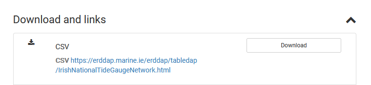
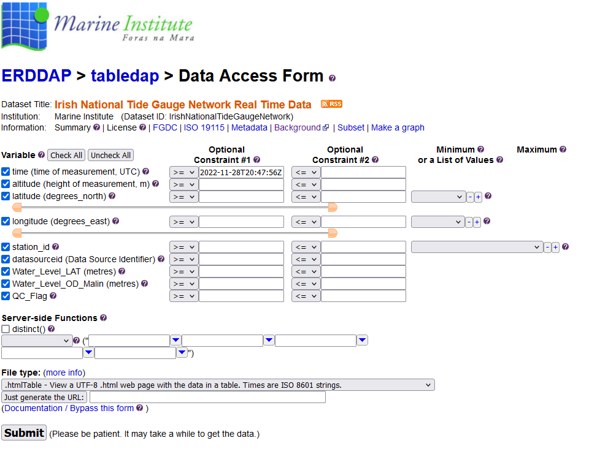

# Tidal Prediction
source code for *Prediction of tide level based on variable weight combination of LightGBM and CNN-BiGRU model*

## Data Source
Visit [here](http://data.marine.ie/geonetwork/srv/eng/catalog.search#/metadata/ie.marine.data:dataset.2774), choose [Irish National Tide Gauge Network Real Time Data](https://erddap.marine.ie/erddap/tabledap/IrishNationalTideGaugeNetwork.html) and then download the raw data. 

  

  

Data units: 

```
,,degrees_east,degrees_north,UTC,millibars,degrees true,knots,knots,meters,seconds,degrees_true,meters,degrees_C,degrees_C,degrees_C,dimensionless,percent,degrees,degrees_true,seconds,
```

## Descriptions of the folders and files in this repositor

- `dataProcessed/`: processed data which will be used in the follow-up study
- `log/`: the log of model training and some intermediate results
- `plot/`: the figures and some plotting in the paper
- `utils/`: models we used in this research
- `Howth Harbour2017/`: prediction results in the Howth Harbour
- `images/`: images used in the README.md
- `result/` & `result(2)/`: some results during our experiments
- `run.py`: the entry point to the program
- `config.py`: parameters in NN
- `*.ipynb`:some test code in our experimentsour experiments

## How to run the program

The following instructions apply to Windows OS. Posix/bash users should check
[here](https://docs.python.org/3/library/venv.html). We also provide some [instructions](https://packaging.python.org/en/latest/guides/installing-using-pip-and-virtual-environments/#creating-a-virtual-environment) for you to consult.

First, clone this repository and open a terminal, such as Powershell.

Create and activate a new virtual environment (recommended, and our developing Python version in this project: **3.9.15**) , and run
the following:

```powershell
python -m venv myvenv
.\myvenv\Scripts\activate
```

Install the requirements:

```powershell
pip install -r requirements.txt
```
Run (and debug):

```powershell
python run.py
```

If you add some new packages to the project, please remember use pip to generate the 'requirements.txt' again (when you use the virtual environment).
```powershell
pip freeze > requirements.txt
```